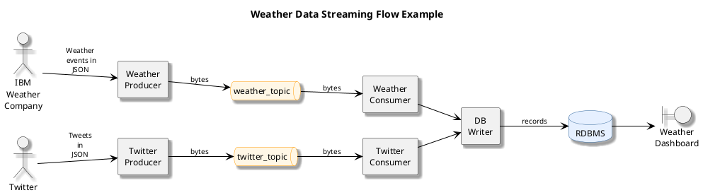
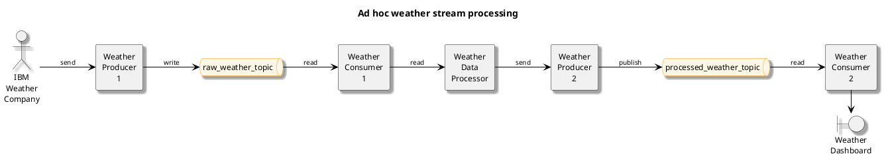
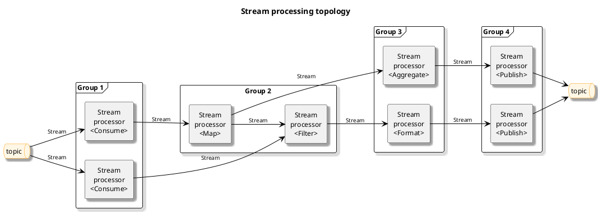
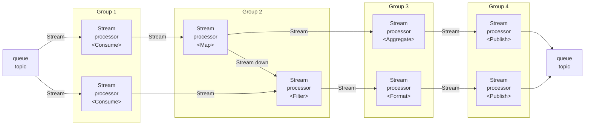
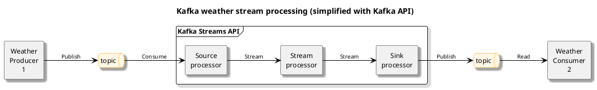
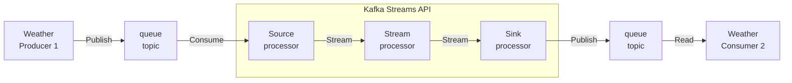

# Streaming Event with Kafka

## Architecture
The core components of kafka are:
- `Brokers` : The dedicqted servers to receive, store, process and distribute events
- `Topics` : The containers or databases of events
- `Partitions`: Divide topics into different brokers
- `Replications`: Duplicate partitions into different brokers
- `Producers`: Kafka client applications that publish events into topics
- `Consumers`: Kafka client applications that subscribe to topics and read events.

There are 3 CLI managing different parts:
- `kafka-topics` CLI manages topics
- `kafka-console-producer` CLI manages producers
- `kafka-console-consumer` CLI manages consumers

## Example of a weather pipeline

## Ad hoc weather stream processing

```mermaid
flowchart LR
    %% Direction: Left to Right
    %% Styling is limited in Mermaid, but we'll use subgraphs and classes

    %% Nodes
    WeatherApi(["IBM<br/>Weather<br/>Company"])
    WeatherProducer1["Weather<br/>Producer 1"]
    WeatherTopic(["raw_weather_topic"])
    WeatherConsumer1["Weather<br/>Consumer 1"]
    WeatherDataProcessor["Weather<br/>Data<br/>Processor"]
    WeatherProducer2["Weather<br/>Producer 2"]
    WeatherTopic2(["processed_weather_topic"])
    WeatherConsumer2["Weather<br/>Consumer 2"]
    WeatherDashboard["Weather<br/>Dashboard"]

    %% Edges
    WeatherApi -->|send| WeatherProducer1
    WeatherProducer1 -->|write| WeatherTopic
    WeatherTopic -->|read| WeatherConsumer1
    WeatherConsumer1 -->|read| WeatherDataProcessor

    WeatherDataProcessor -->|send| WeatherProducer2
    WeatherProducer2 -->|publish| WeatherTopic2
    WeatherTopic2 -->|read| WeatherConsumer2
    WeatherConsumer2 --> WeatherDashboard

    %% Optional grouping (not exactly the same as PlantUML styles)
    classDef db fill:#e6f0ff,stroke:#336699
    classDef queue fill:#fff7e6,stroke:#ff9900

    class WeatherTopic,WeatherTopic2 queue

```

## Kafka Streams API

- A simple client library to facilitate data processing in event streaming pipelines.
- Processes and analyzes data stored in Kafka topics: 
    It receives, transforms, and forwards the processed stream
- Each record only processed once
- Processing one record at a time

```plantuml
@startuml
' Left-to-right direction
left to right direction
' Style settings for cleaner look
skinparam shadowing true
skinparam componentStyle rectangle
skinparam defaultFontSize 12
skinparam defaultTextAlignment center
skinparam wrapWidth 20

skinparam ArrowColor black
skinparam ArrowFontSize 10

skinparam databaseBackgroundColor #e6f0ff
skinparam databaseBorderColor #336699
skinparam queueBackgroundColor #fff7e6
skinparam queueBorderColor #ff9900
skinparam backgroundColor #ffffff

title Ad hoc weather stream processing

rectangle "Kafka\nStreams\nAPI" as kAPI
rectangle "Apache Kafka" as AKafka

kAPI <-- AKafka : Raw streams
kAPI --> AKafka : Processed streams


@enduml
```

## Stream processing topology
 In this tipology, each node is a stream processor, which recceives from its upstream processor.

There are 2 types of special processors.
- The sourcce processor which has no upstream processors
It acts as a consumer which consumes streams from Kafka topics and forward the process streams to its downstreaù processors.
- On the right the sink processor : 
    It has no downstream processors.It acts as a producer which publishes the received stream to a Kafka topic

