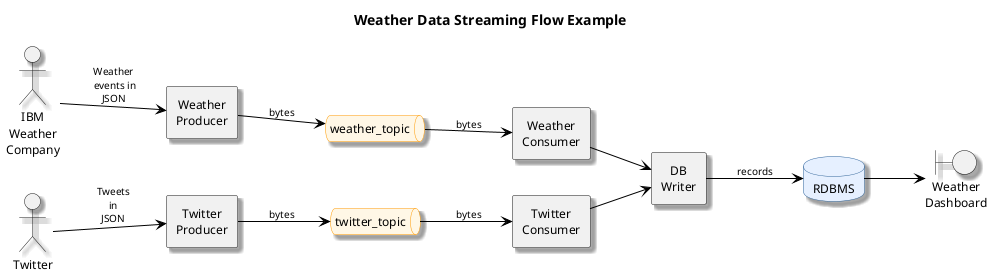

# Streaming Event with Kafka

## Architecture
The core components of kafka are:
- `Brokers` : The dedicqted servers to receive, store, process and distribute events
- `Topics` : The containers or databases of events
- `Partitions`: Divide topics into different brokers
- `Replications`: Duplicate partitions into different brokers
- `Producers`: Kafka client applications that publish events into topics
- `Consumers`: Kafka client applications that subscribe to topics and read events.

There are 3 CLI managing different parts:
- `kafka-topics` CLI manages topics
- `kafka-console-producer` CLI manages producers
- `kafka-console-consumer` CLI manages consumers

## Example of a weather pipeline

